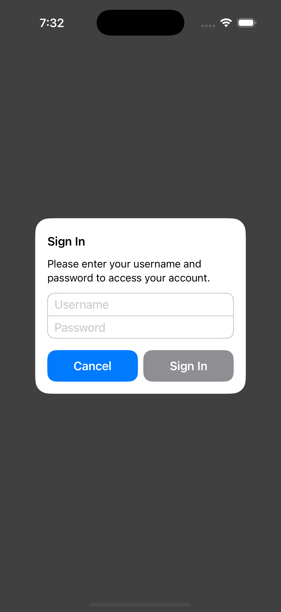
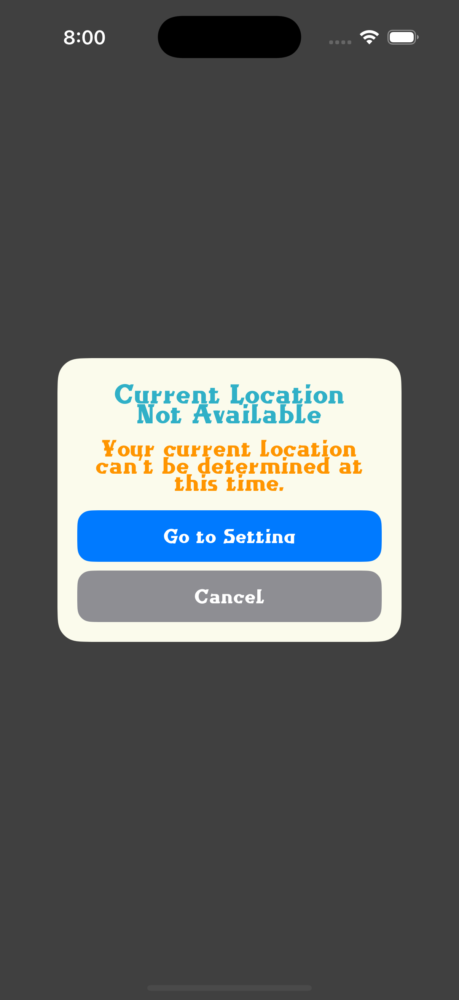
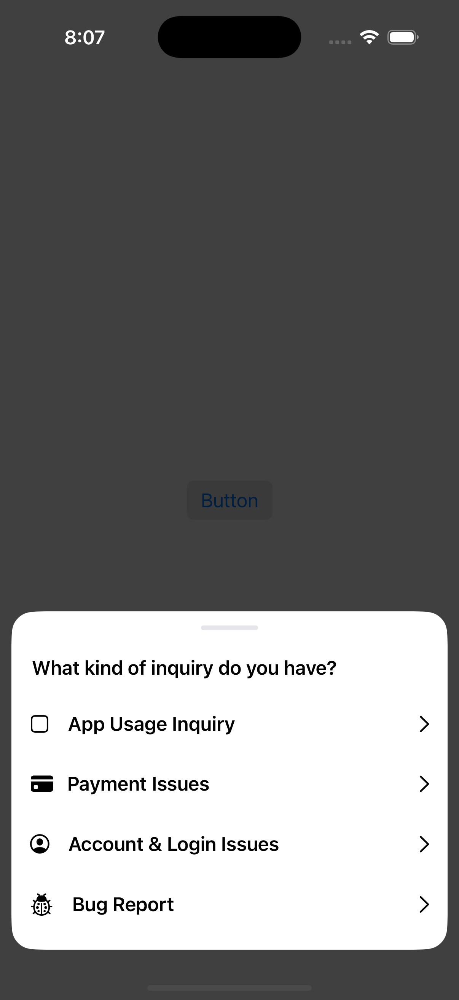
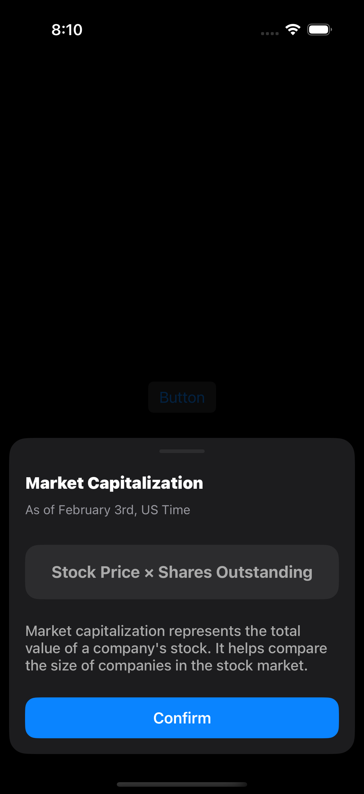
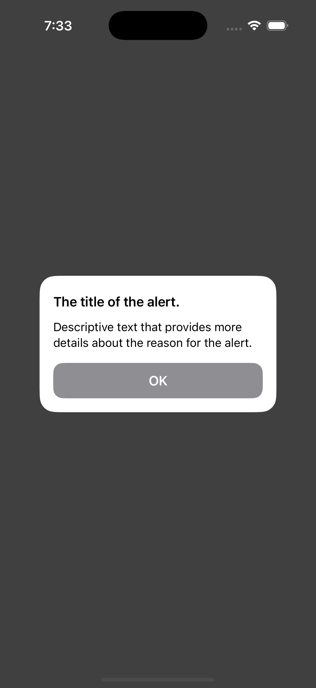
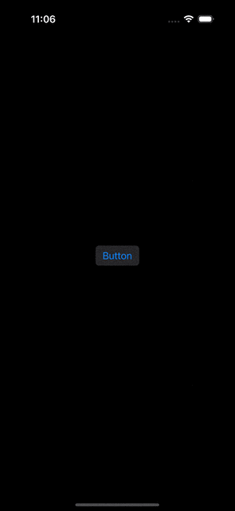

# TSAlertController

<div align="left">

<a href="https://cocoapods.org/pods/TSAlertController">
    
</a>
<a href="https://cocoapods.org/pods/TSAlertController">
    
</a>
<a href="https://cocoapods.org/pods/TSAlertController">
    
</a>

</div>

<br>

<p align="center">
    
    
    
    
</p>

## Usage

To display a simple alert:

```swift
let alert = TSAlertController(
    title: "The title of the alert",
    message: "Descriptive text that provides more details about the reason for the alert.",
    preferredStyle: .alert
)

let okAction = TSAlertAction(title: "OK")
alert.addAction(okAction)

present(alert, animated: true)
```

<details>
  <summary>Preview</summary>

<br>



</details>

TSAlertController mimics the interface of [UIAlertController]() and references other APIs to minimize the learning curve. The customization method has been designed in a similar way to [UIButton.Configuration] and [UIBarAppearance], allowing developers to easily modify the appearance and behavior of the alert using familiar APIs.


And like [UIAlertController](), you can also add a [UITextField]() to the alert:

```swift
let alert = TSAlertController(
    title: "Sign In",
    message: "Please enter your username and password to access your account.",
    options: [.dismissOnTapOutside],
    preferredStyle: .alert
    )

let okAction = TSAlertAction(title: "Sign In")
alert.addAction(okAction)
alert.preferredAction = okAction

let cancelAction = TSAlertAction(title: "Cancel", style: .cancel)
cancelAction.configuration.backgroundColor = .systemBlue
alert.addAction(cancelAction)

alert.addTextField { textfield in
    textfield.placeholder = "Username"
}
alert.addTextField { textfield in
    textfield.placeholder = "Password"
}

present(alert, animated: true)
```

<details>
  <summary>Preview</summary>

<br>


</details>


### Customizing Appearance

To customize fonts, text color, alignment, button group axis, and more, use `TSAlertController.ViewConfiguration`:

```swift
let alert = TSAlertController(
    title: "Current Location Not Available",
    message: "Your current location can't be determined at this time.",
    preferredStyle: .alert
)
let color = UIColor(red: 251.0 / 255.0, green: 251.0 / 255.0, blue: 236.0 / 255.0, alpha: 1)
alert.viewConfiguration.titleTextAlignment = .center
alert.viewConfiguration.titleTextAttributes = [.font: UIFont(name: "Wanderlust", size: 30), .foregroundColor: UIColor.systemTeal]
alert.viewConfiguration.messageTextAlignment = .center
alert.viewConfiguration.messageTextAttributes = [.font: UIFont(name: "Wanderlust", size: 26), .foregroundColor: UIColor.systemOrange]
alert.viewConfiguration.backgroundColor = .color(color)
alert.viewConfiguration.buttonGroupAxis = .vertical

let okAction = TSAlertAction(title: "Cancel", style: .cancel)
okAction.configuration.titleAttributes = [.font: UIFont(name: "Wanderlust", size: 22), .foregroundColor: UIColor.white]
alert.addAction(okAction)

let goToSettingAction = TSAlertAction(title: "Go to Setting")
goToSettingAction.configuration.titleAttributes = [.font: UIFont(name: "Wanderlust", size: 22), .foregroundColor: UIColor.white]
goToSettingAction.configuration.backgroundColor = .systemBlue
alert.addAction(goToSettingAction)

present(alert, animated: true)
```

<details>
  <summary>Preview</summary>

<br>


</details>

For more details, refer to the [ViewConfiguration]() section.


### Interactive Features

TSAlertController also supports interactive user actions:

```swift
let actionSheet = TSAlertController(
    title: "What kind of inquiry do you have?",
    options: [.interactiveScaleAndDrag, .dismissOnSwipeDown, .dismissOnTapOutside],
    preferredStyle: .actionSheet
)
actionSheet.viewConfiguration.margin = .init(buttonLeft: 5, buttonRight: 5)

let config = TSButton.Configuration(
    imageSpacing: 15,
    preferredSymbolConfigurationForImage: .init(paletteColors: [.label]),
    accessoryImage: UIImage(systemName: "chevron.right"),
    preferredSymbolConfigurationForAccessoryImage: .init(paletteColors: [.label]),
    contentAlignment: .left,
    backgroundColor: .clear
)

let appUsageInquiry = TSAlertAction(title: "App Usage Inquiry")
appUsageInquiry.configuration = config
// ... 

let paymentIssue = TSAlertAction(title: "Payment Issues")
// ...

let accountSupport = TSAlertAction(title: "Account & Login Issues")
// ...

let bugReport = TSAlertAction(title: "Bug Report")
// ...

present(actionSheet, animated: true)
```

<details>
  <summary>Preview</summary>

<br>


</details>

As you can see in the preview and infer from the option names, various user interactions can be added to the alert. The `.dismissOnSwipeDown` option allows the alert to disappear when swiped down beyond a certain distance. Similarly, `.dismissOnTapOutside` makes the alert disappear when the dimmed background area outside the alert is tapped.


### Transiton And Animation

TSAlertController supports several transition and animation options:

```swift
let alert = TSAlertController(
    title: "Save it for later?", 
    message: "Your current progress will not be saved.", 
    preferredStyle: .alert
)
alert.viewConfiguration.buttonGroupAxis = .vertical

alert.configuration.enteringTransition = .slideUp
alert.configuration.exitingTransition = .fadeOut

alert.configuration.headerAnimation = .slide()
alert.configuration.buttonGroupAnimation = .fadeIn()

// ...
```

<details>
  <summary>Preview</summary>

<br>



</details>

Transitions define how the alert appears on the screen when the present(_:animated:) method is called, as their names suggest. Animations determine how the internal views of the alert animate when the alert appears.


### Alert With Custom View

You can add a custom-designed view as the header of the alert:

```swift
let marketCap = MarketCapView()
let actionSheet = TSAlertController(
    marketCap,
    options: [.dismissOnSwipeDown, .interactiveScaleAndDrag],
    preferredStyle: .actionSheet
)

let okAction = TSAlertAction(title: "Confirm")
okAction.configuration.backgroundColor = .systemBlue
actionSheet.addAction(okAction)

present(actionSheet, animated: true)
```

<details>
  <summary>Preview</summary>
  
  <br>


</details>


### Configuration options

The `TSAlertController.Configuration` struct defines various behaviors for the alert, including animations and UI preferences.

| Name                   | Description                                                 | Type                                              | Default |
|------------------------|-------------------------------------------------------------|---------------------------------------------------|---------|
| `enteringTransition`   | The transition animation type when the alert appears. For `.actionSheet`, it defaults to `.slideUp`. For `.alert`, it defaults to `.fadeInAndScaleDown`. | `TSAlertController.EnteringTransitionType?`      | `nil`   |
| `exitingTransition`    | The transition animation type when the alert disappears. For `.actionSheet`, it defaults to `.slideDown`. For `.alert`, it defaults to `.fadeOut`. | `TSAlertController.ExitingTransitionType?`       | `nil`   |
| `headerAnimation`      | The animation type for the alert’s header when presented.  | `TSAlertController.AnimationType?`               | `nil`   |
| `buttonGroupAnimation` | The animation type for the button group when presented.    | `TSAlertController.AnimationType?`               | `nil`   |
| `prefersGrabberVisible` | A Boolean value indicating whether a grabber (handle) should be visible. This property applies only to `.actionSheet`, as .alert does not display a grabber. | `Bool` | `true` |


### ViewConfiguration options

The `TSAlertController.ViewConfiguration` struct defines various visual and layout configurations for the alert.

| Name                              |                                    Description                                           | Type                                         | Default |
|-----------------------------------|------------------------------------------------------------------------------------------|----------------------------------------------|---------|
| `titleHeight`                     | The fixed height of the title area. If `nil`, the height adjusts dynamically.            | `CGFloat?`                                  | `nil`   |
| `messageHeight`                   | The fixed height of the message area. If `nil`, the height adjusts dynamically.          | `CGFloat?`                                  | `nil`   |
| `buttonHeight`                    | The height of each button in the button group.                                          | `CGFloat`                                   | `45`    |
| `grabberColor`                    | The color of the grabber (handle) used for dragging.                                    | `UIColor?`                                  | `.systemGray5` |
| `titleAttributes`             | Text attributes for styling the title.                                                  | `[NSAttributedString.Key: Any]?`            | `Headline font with default color` |
| `titleAlignment`              | The text alignment of the title.                                                        | `NSTextAlignment`                           | `.left` |
| `titleNumberOfLines`              | The number of lines for the title. If `0`, the title expands dynamically.               | `Int`                                       | `0`     |
| `messageTextAttributes`           | Text attributes for styling the message.                                                | `[NSAttributedString.Key: Any]?`            | `Subheadline font` |
| `messageTextAlignment`            | The text alignment of the message.                                                      | `NSTextAlignment`                           | `.left` |
| `messageNumberOfLines`            | The number of lines for the message. If `0`, the message expands dynamically.           | `Int`                                       | `0`     |
| `textFieldContainerBorderColor`   | The border color of the container wrapping the text field. This also changes the color of the separator line.                        | `CGColor?` | `.lightGray` |
| `textFieldContainerBorderWidth`   | The border width of the container wrapping the text field. This also changeds the thickness of the separator line.                             | `CGFloat`                                   | `0.75`  |
| `backgroundColor`                 | The background style of the alert.                                                      | `Background`                                | `.systemBackground` |
| `backgroundBorderColor`           | The border color of the alert’s background.                                             | `CGColor?`                                  | `nil`   |
| `backgroundBorderWidth`           | The border width of the alert’s background.                                             | `CGFloat`                                   | `0`     |
| `shadow`                          | The shadow configuration for the alert view.                                            | `Shadow?`                                   | `nil`   |
| `cornerRadius`                    | The corner radius of the alert view.                                                    | `CGFloat`                                   | `20`    |
| `dimmedBackgroundViewColor`       | The background color of the dimmed overlay behind the alert.                            | `Background?`                               | `.black with 0.75 opacity` |
| `margin` | The margins applied around the alert view, defining the spacing between the alert’s boundary and its content, including the button group. | `LayoutMargin` | `.init()` |
| `spacing`                         | The spacing settings applied within the alert layout.                                   | `LayoutSpacing`                             | `.init()` |
| `size`                            | The size configuration of the alert.                                                    | `LayoutSize`                                | `.init()` |
| `buttonGroupAxis`                 | The axis layout of the button group (horizontal or vertical).                           | `ButtonGroupAxis`                           | `.automatic` |

---

#### Background Options

The `TSAlertController.ViewConfiguration.Background` enum defines different background styles for the alert.

| Name       | Description |
|------------|------------|
| `.blur(UIBlurEffect.Style)` | Uses a blurred background with the specified `UIBlurEffect.Style`. |
| `.color(UIColor)` | Uses a solid color background. |
| `.gradient([CGColor], startPoint: CGPoint, endPoint: CGPoint, locations: [NSNumber]?)` | Uses a gradient background with customizable colors, direction, and location stops. |

---

#### LayoutMargin Options

The `TSAlertController.ViewConfiguration.LayoutMargin` struct defines margin settings for content and buttons.

| Name            | Description                               | Type     | Default |
|----------------|-------------------------------------------|---------|---------|
| `contentTop`   | The top margin for the content area.      | `CGFloat` | `22.5`  |
| `contentLeft`  | The left margin for the content area.     | `CGFloat` | `17.5`  |
| `contentRight` | The right margin for the content area.    | `CGFloat` | `17.5`  |
| `buttonLeft`   | The left margin for the button area.      | `CGFloat` | `17.5`  |
| `buttonRight`  | The right margin for the button area.     | `CGFloat` | `17.5`  |
| `buttonBottom` | The bottom margin for the button area.    | `CGFloat` | `17.5`  |

---

#### LayoutSpacing Options

The `TSAlertController.ViewConfiguration.LayoutSpacing` struct defines spacing settings within the alert layout.

| Name                      | Description                                           | Type     | Default |
|---------------------------|-------------------------------------------------------|---------|---------|
| `titleMessageSpacing`     | Spacing between the title and the message.           | `CGFloat` | `12.5`  |
| `messageTextfieldSpacing` | Spacing between the message and the text field. Ignored if no text field is present.     | `CGFloat` | `12.5`  |
| `textfieldButtonSpacing`  | Spacing between the text field and the button. If there is no text field, this spacing applies between the message and the button.      | `CGFloat` | `16.5`  |
| `buttonSpacing`           | Spacing between buttons in the button group.        | `CGFloat` | `7.5`   |
| `keyboardSpacing`         | Spacing between the bottom of the alert and the keyboard. The default value is 20 for action sheets and 100 for alerts. | `CGFloat` | `100`   |

---

#### LayoutSize Options

The `TSAlertController.ViewConfiguration.LayoutSize` struct defines the width and height constraints of the alert.

| Name    | Description                         | Type                         | Default |
|---------|-------------------------------------|------------------------------|---------|
| `width` | Width constraint for the alert.    | `LayoutSize.Constraint`      | `.proportional()` |
| `height` | Height constraint for the alert.  | `LayoutSize.Constraint`      | `.proportional()` |

---

#### LayoutSize.Constraint Options

The `TSAlertController.ViewConfiguration.LayoutSize.Constraint` enum defines different constraints for width and height.

| Name | Description |
|------|------------|
| `.fixed(CGFloat)` | Sets a fixed size for the alert. |
| `.flexible(minimum: CGFloat, maximum: CGFloat)` | Sets a flexible size with minimum and maximum values. |
| `.proportional(minimumRatio: CGFloat, maximumRatio: CGFloat)` | Sets a size relative to the screen size. |

---

#### ButtonGroupAxis Options

The `TSAlertController.ViewConfiguration.ButtonGroupAxis` enum defines the layout direction of buttons in the alert.

| Name          | Description |
|--------------|------------|
| `.automatic` | Uses a horizontal layout if there are two or fewer buttons; otherwise, uses a vertical layout. |
| `.vertical`  | Forces a vertical button layout. |
| `.horizontal` | Forces a horizontal button layout. |

 
## Examples

You can find the example files [here](./Example/TSAlertController/Presentation/ViewController.swift).


 ## Roadmap

You can check the upcoming changes for TSAlertController [here](./ROADMAP.md).
 
 
 
## Installation

### Swift Package Manager

You can use The Swift Package Manager to install Toast-Swift by adding the description to your Package.swift file:

```swift
dependencies: [
    .package(url: "https://github.com/rlarjsdn3/TSAlertController-iOS.git", from: "1.0.0")
]
```

### CocoaPods

```ruby
pod "TSAlertController"
```

## Requirements

Swift 5+ | iOS 15.0+


## Contribution

All types of contributions are welcome, from minor typo fixes and comment improvements to adding new features! Bug reports and feature requests are also highly appreciated, and I will actively review them.  

TSAlertController is continuously updated with the goal of providing an easy-to-use, modern, and elegant alert system for everyone. I truly appreciate your support! 😃   

<div align="left">

<!-- Replace with actual contributor images -->
<a href="#"></a>
<a href="#"></a>
<a href="#"></a>
<a href="#"></a>
<a href="#"></a>

</div>

## License

TSAlertController is available under the MIT license. See the LICENSE file for more info.
